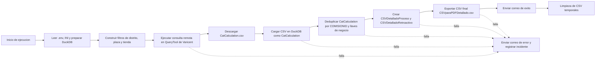

# PDD - CSVScriptDetallado

## 0. Control del documento

| Campo | Valor |
|---|---|
| Cliente | FEMCO / ICM |
| Nombre del proceso / solucion | CSVScriptDetallado |
| Tipo de documento | PDD |
| Version | 1.0 |
| Fecha | 2026-04-22 |
| Autor | Codex |
| Colaboradores | No informado |

## 1. Propuesta Tecnica

CSVScriptDetallado es un proceso automatizado en Python que extrae informacion operativa desde Varicent ICM, la materializa temporalmente en CSV, la carga y transforma en DuckDB local, y finalmente exporta un archivo CSV de salida para consumo desacoplado por PDFScriptDetallado. La solucion centraliza la consulta remota, el tratamiento local, la notificacion por correo y la trazabilidad operativa en un solo flujo controlado.

La propuesta tecnica busca eliminar pasos manuales repetitivos, reducir el riesgo de errores de captura y asegurar que el resultado final se genere siempre con la misma estructura, nombre y ruta de salida. Para ello, el proceso integra QueryTool de Varicent, el servicio de correo, un archivo de configuracion INI, variables de entorno en `.env` y una base local DuckDB usada como area de consolidacion y validacion.

Los componentes principales de la solucion son:

- Orquestador en Python ubicado en `root/scripts/ScriptCSVDetallado/__main__.py`.
- Configuracion operativa en `root/scripts/Settings/ConfigScriptCSVDetallado.ini`.
- Variables y secretos globales en `root/scripts/.env`.
- Base local DuckDB en `root/scripts/Settings/localbd_CSVFiniquitoDetallado.duckdb`.
- Registro operativo en `root/scripts/Logs/CSVFiniquitoDetallado.log`.
- Salida final en `root/Data/CSVparaPDFDetallado.csv`.

El valor esperado es una ejecucion mas estable, auditable y repetible, con evidencia suficiente para soporte, y con un archivo CSV final listo para el proceso posterior de PDFScriptDetallado.

## 2. Solucion

### 2.1 Situacion Actual

La operacion depende de un script Python que concentra la extraccion desde Varicent ICM, la carga en DuckDB, la deduplicacion funcional, la exportacion del CSV final y el envio de notificaciones. La ejecucion requiere configuracion vigente en INI, variables de entorno y disponibilidad de la API remota. Si alguno de esos elementos falla, la corrida se detiene y se registra la incidencia en el log. Ademas, el proceso conserva nombres legados como CSVFiniquitoDetallado en correos y registros.

Situacion observada en la operacion actual:
- Dependencia de tareas manuales con variabilidad de criterios entre usuarios.
- Riesgo de retrabajo por inconsistencias de carga, interpretacion o consolidacion.
- Visibilidad limitada de metricas de proceso y tiempos por etapa.
- Baja trazabilidad frente a auditorias o revisiones de negocio.

### 2.2 Situacion Esperada

Se espera una ejecucion controlada de punta a punta, con validacion temprana de parametros opcionales, descarga remota de CatCalculation, carga y transformacion local en DuckDB, exportacion de un CSV final configurable y notificacion automatica por correo al concluir con exito o error. El resultado debe quedar listo para consumo desacoplado por PDFScriptDetallado.

Resultado esperado en escenario TO-BE:
- Flujo estandarizado y repetible para todos los usuarios habilitados.
- Reduccion de tiempos de ciclo y mayor consistencia de resultados.
- Disponibilidad de evidencia operativa para seguimiento y auditoria.
- Mejor soporte a decisiones de negocio mediante informacion estructurada.

### 2.3 Metricas

- Ejecuciones por mes: No informado.
- Frecuencia: Mensual o bajo demanda operativa.
- Tiempo manual estimado: No informado.
- SLA esperado: No informado.

### 2.4 Restricciones operativas

Las restricciones operativas definen las condiciones minimas para que la ejecucion sea valida y repetible. El proceso no esta pensado para resolver dependencias en tiempo de corrida, por lo que toda configuracion tecnica debe estar disponible antes del arranque.

- La corrida requiere variables de entorno vigentes en `.env` y no solicita captura interactiva de credenciales.
- El archivo `ConfigScriptCSVDetallado.ini` debe conservar una seccion `DEFAULT` valida para correo, filtros y ruta de salida.
- La ejecucion depende de la disponibilidad de Varicent ICM QueryTool y del servicio de notificacion por correo.
- La tabla `DateStringPeriods` debe devolver al menos un periodo con `IsOutputInterface = SI` para determinar la ventana operativa.
- DuckDB debe poder abrir la base local y contar con memoria suficiente para el volumen devuelto por la consulta remota.
- La ruta temporal debe permitir creacion, lectura y eliminacion de CSV temporales sin bloqueo de antivirus o politicas del sistema.
- El nombre de salida `CSVparaPDFDetallado.csv` debe mantenerse estable para no romper el consumo posterior.
- No se permiten ejecuciones concurrentes sobre la misma base DuckDB ni sobre el mismo directorio temporal.

## 3. Alcance

El proceso comprende la extraccion de datos desde Varicent ICM, su materializacion temporal en CSV, la carga y tratamiento en DuckDB, la generacion del archivo final `CSVparaPDFDetallado.csv`, la creacion de tablas intermedias y la notificacion automatica por correo al terminar la corrida. Tambien incluye la limpieza de temporales y el registro de eventos operativos.

### 3.1 Diagrama de Flujo General

### 3.2 Detalles del proceso

La ejecucion inicia cuando el usuario o el programador externo lanza CSVScriptDetallado. En ese momento el proceso identifica su ruta real de ejecucion, resuelve las carpetas operativas, prepara el directorio de logs y confirma que la base DuckDB local exista y pueda abrirse en modo escritura. Esta etapa evita arrancar una corrida con una estructura incompleta o con archivos faltantes que impedirian continuar.

Posteriormente se cargan las variables de entorno y la configuracion funcional desde los archivos correspondientes. Con esa informacion el proceso construye el contexto de autenticacion para QueryTool, valida que existan las credenciales necesarias para Varicent ICM y lee los filtros opcionales de distrito, plaza y tienda. Si alguno de esos parametros existe en la configuracion, el proceso lo normaliza y lo deja listo para incrustarlo en la consulta remota sin que el usuario tenga que editar SQL manualmente.

Con el entorno preparado, el proceso construye y ejecuta la consulta remota que descarga CatCalculation.csv. La consulta se apoya en la tabla DateStringPeriods para determinar el periodo de trabajo de forma dinamica, por lo que ya no depende de un mes parametrizado en el INI. A partir de ese periodo se arman los subconjuntos auxiliares que enriquecen el resultado, y los filtros de distrito, plaza y tienda se aplican solo cuando la configuracion los informa. Si el servicio remoto responde con error o con un conjunto vacio, la corrida se interrumpe y queda la traza de soporte en el log.

Una vez recibido el archivo, este se inserta en DuckDB como la tabla base CatCalculation. Antes de continuar se valida que el archivo temporal exista y que tenga estructura utilizable; despues la tabla se recrea para evitar arrastre de ejecuciones anteriores. Sobre esa base se aplican las transformaciones locales, incluyendo la deduplicacion funcional por COMISIONID y llaves de negocio relacionadas, con el fin de conservar un registro representativo por combinacion operativa y evitar duplicados en el resultado final.

Despues de la consolidacion, el flujo crea CSVDetalladoProceso como salida principal y CSVDetalladoRetroactivo como estructura complementaria esperada por el modelo. En paralelo se calculan los conteos de registros para dejar evidencia de la cantidad procesada y validar que la informacion exportada coincide con lo preparado en memoria. Con eso se exporta el CSV final en la ruta definida por la configuracion y se deja el archivo listo para consumo desacoplado por PDFScriptDetallado, el cual utiliza esa salida como fuente para la generacion de los documentos finales.

Antes de cerrar, el proceso emite la notificacion de exito por correo cuando todo termina correctamente, indicando que la tabla de salida se encuentra disponible para validacion operativa. Si ocurre cualquier error en descarga, carga, transformacion, exportacion o notificacion, la excepcion se registra, se envia un correo de falla y se mantiene evidencia en el log para soporte operativo. De esta forma el equipo puede distinguir entre fallas de conectividad, problemas de datos origen y errores de configuracion sin revisar el codigo fuente.

Finalmente se eliminan los CSV temporales generados durante la corrida para evitar residuos en el directorio operativo. Esta limpieza deja solo la salida formal y la trazabilidad necesaria para auditoria, soporte y reejecucion posterior. En caso de reintento, el flujo parte de una ruta limpia y reduce el riesgo de mezclar archivos de ejecuciones previas con la corrida vigente.

### 3.3 Sistemas involucrados

| Sistema | Descripcion | URL / Ambiente |
|---|---|---|
| Varicent ICM QueryTool | Fuente remota de datos y motor de exportacion de consultas SQL. | `https://api.cloud.varicent.com/api/v1/rpc/querytool/export` |
| Varicent ICM Mail API | Servicio usado para notificaciones de exito y error. | `https://api.cloud.varicent.com/api/v1/admin/tsapi/sendMail` |
| DuckDB local | Base temporal local para cargar, transformar y exportar la informacion. | `root/scripts/Settings/localbd_CSVFiniquitoDetallado.duckdb` |
| ConfigScriptCSVDetallado.ini | Parametrizacion funcional de correos, filtros opcionales y ruta de salida. | `root/scripts/Settings/ConfigScriptCSVDetallado.ini` |
| .env | Variables de entorno y secretos globales del proceso. | `root/scripts/.env` |
| PDFScriptDetallado | Proceso consumidor del CSV final generado por este flujo. | Ambiente local o empaquetado, segun ejecucion |

## 4. Fuera de Alcance

El flujo fue disenado para automatizar la extraccion, transformacion y publicacion del CSV final. Todo lo que implique correccion manual de datos, redisenio funcional del modelo o cambios en los consumidores posteriores queda fuera del alcance del proceso.

- La maquetacion o generacion de PDF final.
- La correccion manual de informacion origen dentro de Varicent.
- La depuracion de calidad de datos en sistemas fuente fuera del filtro operativo.
- La administracion de usuarios, permisos o secretos fuera de las variables requeridas por el proceso.
- La orquestacion de calendarios o schedulers externos.
- La redistribucion de datos a sistemas distintos a `PDFScriptDetallado`.
- La carga manual de CSV temporales fuera del flujo automatizado.
- La modificacion de consultas SQL desde el codigo en tiempo de operacion.
- La conciliacion manual de diferencias entre la salida del CSV y la fuente remota.
- La creacion de nuevos canales de notificacion o formatos de salida no definidos en la configuracion.
- La correccion manual del archivo final despues de su exportacion.
- La administracion de la infraestructura de red, firewall o certificados ajena al script.

## 5. Areas de negocio involucradas

- Compensaciones y finiquitos, inferido a partir del uso de `CatCalculation` y del modelo ICM FEMCO.
- Operacion comercial, inferida por los filtros de plaza, tienda y distrito.
- Tecnologia de la informacion / Automatizacion, por la operacion del script, la integracion con API y la gestion de logs.

## 6. Excepciones

### 6.1 Excepciones de negocio

Las excepciones de negocio no siempre implican una falla tecnica. En varios casos el flujo termina correctamente, pero el resultado debe revisarse porque no representa el universo esperado por la operacion.

- El periodo configurado no devuelve registros y la salida final queda vacia.
- El filtro de distritos, plazas o tiendas reduce la salida a cero filas.
- La consulta remota no encuentra datos dentro del rango de periodo esperado.
- El modelo fuente cambia de estructura funcional y `CatCalculation` deja de representar la base correcta.
- La informacion remota llega incompleta para un distrito o una plaza especifica, generando un corte parcial que negocio debe revisar antes de validar resultados.
- La fuente contiene movimientos fuera del periodo operativo y quedan excluidos por el filtro de fechas, lo que puede producir diferencias frente a reportes de otras fuentes.

### 6.2 Excepciones de sistema

Las excepciones de sistema si detienen la corrida o impiden cerrar el flujo con evidencia completa. Son fallas de infraestructura, configuracion o integracion que requieren atencion tecnica antes de reintentar.

- Falta `API_KEY` o `model` en `.env`.
- Falta `ToEmail` en `ConfigScriptCSVDetallado.ini`.
- La API de Varicent responde con error HTTP, timeout o credenciales invalidas.
- No se encuentra `CatCalculation` en la respuesta remota.
- El directorio de salida no tiene permisos de escritura.
- DuckDB no puede abrir la base local o excede el limite de memoria configurado.
- El proceso de correo falla al intentar notificar el resultado.
- El archivo `ConfigScriptCSVDetallado.ini` no existe, se encuentra corrupto o no contiene la seccion `DEFAULT`.
- La descarga remota genera un CSV parcial o truncado antes de finalizar la transferencia.
- La ruta temporal contiene un archivo bloqueado por otro proceso y la limpieza no puede completarse.
- El script se ejecuta con una version de libreria incompatible con el entorno de ICM.

### 6.3 Problemas conocidos, dependencias y suposiciones

Esta seccion resume condiciones que no son necesariamente fallas, pero que deben conocerse para interpretar el comportamiento real del proceso y sus dependencias tecnicas.

- La operacion depende de la disponibilidad de Varicent ICM y de sus APIs, por lo que una caida de red o una ventana de mantenimiento rompe el flujo completo.
- El archivo de salida debe conservar el nombre y la ruta acordados con `PDFScriptDetallado`; si el consumidor cambia de carpeta o extension, la integracion se rompe hasta ajustar configuracion.
- El proceso conserva referencias de nomenclatura legacy en notificaciones y logs, donde aparece `CSVFiniquitoDetallado` en lugar de `CSVScriptDetallado`, lo que puede confundir revisiones manuales si no se conoce el legado.
- Se asume que el archivo `ConfigScriptCSVDetallado.ini` es administrado por el equipo operativo antes de cada corrida y que `ToEmail` siempre apunta a una bandeja activa.
- Se asume que los valores de filtro en el `INI` son validos y compatibles con los campos del modelo origen, incluyendo formato de distrito, plaza y tienda.
- Se asume que la tabla `DateStringPeriods` existe y contiene al menos un periodo marcado como `IsOutputInterface = 'SI'`; sin esa referencia no hay forma de determinar la ventana operativa.
- Se asume que el volumen devuelto por QueryTool cabe en el limite de memoria definido para DuckDB y que el tiempo de ejecucion entra en la ventana operativa disponible.
- Se asume que la estructura del resultado remoto mantiene la columna `COMISIONID` y los campos utilizados para deduplicacion y exportacion.
- Se asume que no hay ejecuciones concurrentes sobre la misma base DuckDB ni sobre el mismo directorio de temporales.
- Se asume que el equipo consumidor de `CSVparaPDFDetallado.csv` respeta el mismo contrato de nombre, ruta y codificacion del archivo.
- Se asume que el antivirus o las politicas de seguridad del servidor no bloquean la creacion o eliminacion de archivos CSV temporales.
- Se asume que la ventana de ejecucion de ICM permite completar descarga, carga, exportacion y notificacion sin interrupciones externas.

### 6.4 Salida / Entregable

El entregable principal del proceso es el archivo CSV final generado en la ruta configurada. Este archivo representa la salida formal que consume el proceso posterior y debe conservar el contrato de nombre, formato y codificacion acordado.

- `root/Data/CSVparaPDFDetallado.csv`

Como salida complementaria, el proceso deja evidencia en:

- `root/scripts/Logs/CSVFiniquitoDetallado.log`
- correo electronico de exito o error enviado a los destinatarios configurados
